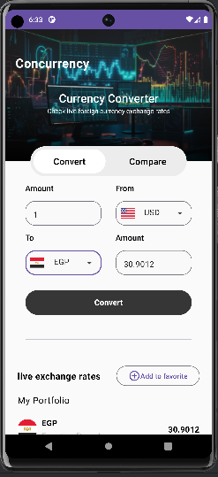
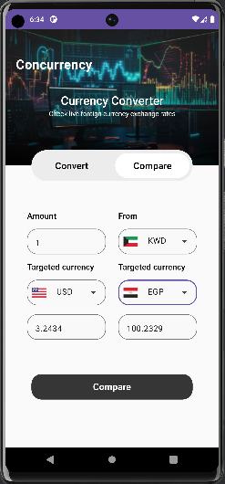
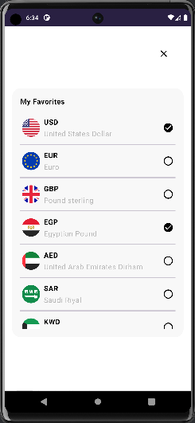

# Currency Conversion Application README

Currency Conversion is an Android application built using Kotlin and Jetpack Compose that provides users with various functionalities related to currency conversion and exchange rates. This README provides an overview of the application and its key features.

## Table of Contents

- [Introduction](#introduction)
- [Features](#features)
  - [Currency Conversion](#currency-conversion)
  - [Real-Time Exchange Rate](#real-time-exchange-rate)
  - [Favorite Currencies](#favorite-currencies)
  - [Currency Comparison](#currency-comparison)
- [Architecture](#architecture)
- [Screenshots](#screenshots)
- [Getting Started](#getting-started)
- [Dependencies](#dependencies)
- [Contributing](#contributing)

## Introduction

Currency Conversion is an Android application that empowers users to efficiently handle currency-related tasks, including conversion, exchange rate tracking, favorite currency management, and currency comparison. The application is developed using the Model-View-ViewModel (MVVM) architecture pattern, allowing for a clear separation of concerns and easy maintenance.

## Features

### Currency Conversion

The Currency Conversion feature allows users to convert between different currencies. Users can enter an amount in one currency and instantly see the equivalent amount in another selected currency.

### Real-Time Exchange Rate

ConCurrency provides users with real-time exchange rates for a wide range of currencies. Exchange rates are updated at regular intervals to ensure accuracy.

### Favorite Currencies

Users can mark specific currencies as their favorites, making it convenient to track exchange rates for these currencies on the main screen.

### Currency Comparison

The Currency Comparison feature enables users to compare the exchange rates of two different currencies side by side. This helps users make informed decisions about currency conversion.

## Architecture

The application follows the MVVM (Model-View-ViewModel) architecture pattern:

- **Model**: Represents the data and business logic of the application. Manages data sources, repository, and API calls.
- **View**: Defines how the UI looks using Jetpack Compose components. Observes ViewModel for changes in data.
- **ViewModel**: Manages UI-related data and communicates with the Model. Provides data to the View and handles user interactions.

## Screenshots

*Screenshot 1: Currency Conversion*

*Screenshot 2: Real-Time Exchange Rate*

*Screenshot 3: Favorite Currencies*

*Screenshot 4: Currency Comparison*

## Getting Started

To run the ConCurrency application locally:

1. Clone this repository: `https://github.com/Sobhy-Abdelhakam/BankMisr.git`
2. Open the project in Android Studio.
3. Build and run the application on an emulator or a physical device.

## Dependencies

ConCurrency relies on the following key dependencies:

- Jetpack Compose
- ViewModel, LiveData and stateFlow
- Retrofit for network requests
- Room for local data storage
- Coroutine for asynchronous operations

For a complete list of dependencies, please refer to the `build.gradle` files.

## Contributing

Contributions to ConCurrency are welcome! Feel free to open issues and submit pull requests. For major changes, please open an issue to discuss your ideas.
